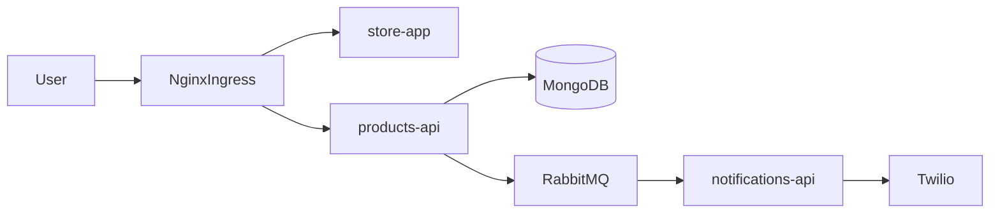

# Microservices on Kubernetes

[](https://nodejs.org/)
[](https://reactjs.org/)
[](https://www.mongodb.com/)
[](https://www.rabbitmq.com/)
[](https://www.docker.com/)
[](https://kubernetes.io/)
[](https://aws.amazon.com/eks/)
[](https://github.com/features/actions)
[](https://opensource.org/licenses/MIT)

Event-driven e-commerce demo: **React** storefront, **Node.js** microservices, **MongoDB**, **RabbitMQ**, and **Kubernetes** (Docker Desktop locally, **AWS EKS** in the cloud), with a **GitHub Actions** deploy pipeline.

---

## Table of contents

- [Overview](#overview)
- [Architecture](#architecture)
- [Tech stack](#tech-stack)
- [Features](#features)
- [Repository structure](#repository-structure)
- [Getting started](#getting-started)
  - [Local: Docker Desktop + Kubernetes](#local-docker-desktop--kubernetes)
  - [AWS EKS](#aws-eks)
- [API reference](#api-reference)
- [Cleanup](#cleanup)
- [Roadmap](#roadmap)
- [License](#license)

---

## Overview

**Golden Bakery** is a small storefront where customers browse products, place orders, and receive an SMS when an order is marked **DELIVERED**. The project showcases how to split concerns across services, persist data in MongoDB, use RabbitMQ for asynchronous notification delivery, and run everything on Kubernetes with Ingress-based routing and optional CI/CD to EKS.

---

## Architecture



**Components**

- **`store-app`** (React, port **80** in cluster) — SPA UI; calls the API under `/api/*` via Ingress.
- **`products-api`** (Express + Mongoose, port **5002**) — REST API for products and orders; when order status becomes `DELIVERED`, publishes the customer phone number to RabbitMQ queue `jobs`.
- **`notifications-api`** (Express + amqplib + Twilio, port **5001**) — Consumes `jobs` and sends SMS delivery notifications.
- **MongoDB** — Products and orders (with a PersistentVolumeClaim for data).
- **RabbitMQ** — Message broker between `products-api` and `notifications-api`.
- **Ingress** — NGINX Ingress routes `/` to the storefront and `/api` to `products-api` (see [`k8s/ingress-service.yaml`](k8s/ingress-service.yaml)).

---

## Tech stack

- **Frontend:** React 18, Chakra UI, Axios, Framer Motion (`store-app/`)
- **Backend:** Node.js, Express, Mongoose (`products-api/`), amqplib + Twilio (`notifications-api/`)
- **Data & messaging:** MongoDB, RabbitMQ
- **Infra & DevOps:** Docker, Kubernetes (Deployments, Services, ConfigMap, Secrets, PVC, Ingress), NGINX Ingress Controller, AWS EKS, GitHub Actions ([`store-app/.github/workflows/deployment.yaml`](store-app/.github/workflows/deployment.yaml))

---

## Features

- REST API for catalog and orders with MongoDB persistence
- Event-driven SMS via RabbitMQ when an order reaches `DELIVERED`
- Kubernetes manifests for workloads, networking, storage, and ingress (`k8s/`)
- Horizontal scaling example (`replicas: 2` on selected deployments)
- Local cluster parity (Docker Desktop Kubernetes) and AWS-oriented ingress ([`k8s/ingres-aws.yaml`](k8s/ingres-aws.yaml))
- CI/CD: build/push Docker image and roll out to EKS via `kubectl set image` (workflow file in repo)

---

## Repository structure

```
microservices_k8s/
├── k8s/                      # Kubernetes manifests (deployments, services, ingress, MongoDB, RabbitMQ)
├── store-app/                # React frontend (Create React App)
├── products-api/             # Products & orders API
├── notifications-api/        # RabbitMQ consumer + Twilio SMS
├── ingress-docker-desktop.yaml   # NGINX Ingress Controller install (Docker Desktop / local)
├── run_all_k8s.sh            # kubectl apply -f k8s
└── stop_all.sh               # kubectl delete all --all
```

---

## Getting started

### Prerequisites

- [Docker Desktop](https://www.docker.com/products/docker-desktop/) with **Kubernetes enabled** (or any Kubernetes cluster)
- [`kubectl`](https://kubernetes.io/docs/tasks/tools/) configured for your cluster
- A [Twilio](https://www.twilio.com/) account (Account SID, Auth Token, and sending number) if you want real SMS

### Local: Docker Desktop + Kubernetes

1. **Install the NGINX Ingress Controller** (required before Ingress resources work):

   ```bash
   kubectl apply -f ingress-docker-desktop.yaml
   ```

   Wait until the ingress controller pods are ready (`kubectl get pods -n ingress-nginx`).

2. **Create the Twilio secret** (values are examples — use your own credentials):

   ```bash
   kubectl create secret generic twilio-secret \
     --from-literal=TWILIO_ACCOUNT_SID="<your-account-sid>" \
     --from-literal=TWILIO_AUTH_TOKEN="<your-auth-token>" \
     --from-literal=TWILIO_NUMBER="+1234567890"
   ```

   This matches the `secretKeyRef` used in [`k8s/notifications-api-deployment.yaml`](k8s/notifications-api-deployment.yaml).

3. **Apply application manifests:**

   ```bash
   ./run_all_k8s.sh
   ```

   Or: `kubectl apply -f k8s/`

4. **Routing**

   - Apply or adjust the app Ingress in [`k8s/ingress-service.yaml`](k8s/ingress-service.yaml). For local development, set `spec.rules[].host` to `localhost` (or add a hostname in `/etc/hosts`) so traffic matches the rule.
   - Access the app at `http://localhost` (or your chosen host) once DNS/hosts and Ingress are aligned.

> **Note:** The workflow file lives under `store-app/.github/workflows/`. GitHub Actions discovers workflows from `.github/workflows/` at the **repository root**; copy or move the workflow there if you want GitHub to run it automatically.

### AWS EKS

1. Ensure the EKS cluster exists and `kubectl` is configured (`aws eks update-kubeconfig ...`).
2. Apply manifests under `k8s/` and configure secrets (Twilio) as above.
3. Use AWS-oriented ingress as needed: [`k8s/ingres-aws.yaml`](k8s/ingres-aws.yaml) (alongside or instead of local Ingress, depending on your setup).
4. **GitHub Actions** (see [`store-app/.github/workflows/deployment.yaml`](store-app/.github/workflows/deployment.yaml)):
   - Trigger: push to `master`
   - Required repository secrets: `AWS_ACCESS_KEY_ID`, `AWS_SECRET_ACCESS_KEY`, `DOCKERHUB_USERNAME`, `DOCKERHUB_PASSWORD`
   - The job builds and pushes the store image, then runs `kubectl set image deployment/store ...` against the configured EKS cluster.

---

## API reference

Base path on the cluster is `/api` (rewritten to the API service). Endpoints in [`products-api/index.js`](products-api/index.js):

- **`GET /products`** — List products  
- **`POST /products`** — Create a product (`name`, `image`, `description`, `price`)  
- **`GET /orders`** — List orders  
- **`POST /orders`** — Create order (`order`, `phone`, `address`); initial status `PLACED`  
- **`PUT /orders/:id`** — Update order; setting `status` to **`DELIVERED`** publishes the phone number to RabbitMQ for SMS

---

## Cleanup

```bash
./stop_all.sh
```

This runs `kubectl delete all --all`. Adjust if you need to preserve namespaces or CRDs.

---

## Roadmap

- Automated tests (API + UI) and CI quality gates
- Observability: structured logging, metrics, and tracing
- Helm chart or Kustomize overlays for environments
- Secrets management (e.g. Sealed Secrets, SOPS) and rotate Twilio credentials out of any legacy inline examples in source
- Align Kubernetes service names with Ingress backends where needed for friction-free local deploys

---

## License

This project is licensed under the **MIT License** — see the [MIT License](https://opensource.org/licenses/MIT) text on opensource.org. Add a root `LICENSE` file when you publish if you want the standard GitHub license badge to resolve to a file in-repo.
